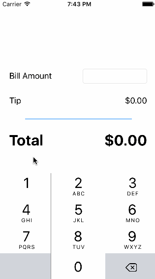

# TipCalculator - tipslash

Author: David Lasher

Date: 1/13/2016

This is a Tip Calculator application for iOS submitted as the [pre-assignment](https://gist.github.com/timothy1ee/7747214) requirement for CodePath.

Time spent: [5 Hours]
  Hour 1: Watch the first half of the video, pausing and coding along
  Hour 2: Complete the video, debug, satisfy the first requirement
  Hour 3: Add a Settings option, without adding a new view **
  Hours 4 & 5: Add a Settings view, and wire up the ability to set a default tip percentage

Completed:

* [X] Required: User can enter a bill amount, choose a tip percentage, and see the tip and total values.
* [X] Required: Settings page to change the default tip percentage.***

Notes:
 ** I left the code commented out in the application as defined in Hour 3 above, as a way of "showing my work", the evolution from a Settings page that is on the same view, to a Settings page that has its own controller.

 *** The ability to change default tip percentage only lasts for that current session.

GIF created with [LiceCap](http://www.cockos.com/licecap/).

Installation Instructions:

  Open the workspace in Xcode (for what it's worth, I created this on 7.2) and hit the "Play" button in the top left to run Simulator.

Application Description:

  Simple tip calculator: enter the amount of your bill, and the calculator will display how much you should tip. You may change the tip amount to be 18, 20, or 22 percent of the total bill. The application defaults to 20%, but you may override this via the Settings page.

  Contrary to how you may expect this setting to behave, it does not persist between sessions. It does however behave as a default should, where setting the default tip amount overrides the current tip amount, while changes to the current tip amount don't alter the default tip amount. Happy to continue to put time into this for additional features, but in the spirit of shipping an MVP I am submitting now,  5 hours in with the required features implemented.
